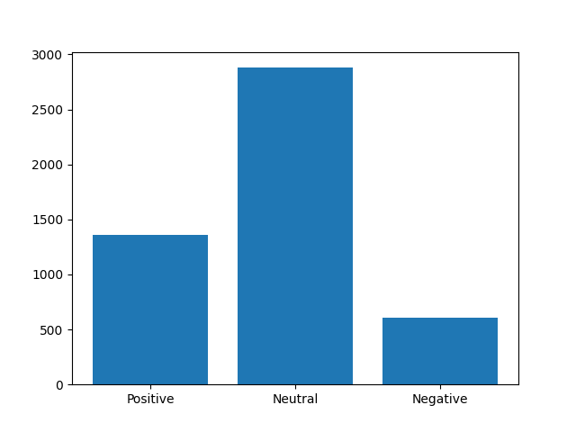

# CHARLES
Using an RNN to detect stock variability

This project is a multi component analysis of stock variability. I will use sentiment from news and other sources as a metric for the variability, as well as some others like fourier transforms.

## Step 1.a: Using RNN

Using tensorflow to detect sentiment from imdb reviews. I will use this model to detect the sentiment of financial articles.

## Step 1.b: Using BERT

Using the pre-trained BERT model to see if there is a better accuracy for this model

In general, the data set used to train has the following sentiments:

## Step 2:

Train model for news articles

